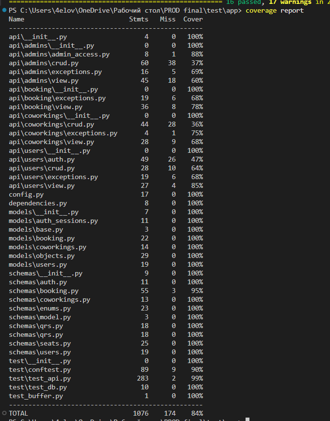

### Описание функционала, покрытого тестами

Тесты, представленные в коде, охватывают следующие ключевые функциональные модули системы бронирования коворкинг-пространства:

---

#### **1. Авторизация и аутентификация**
- **Регистрация пользователя**: Проверка создания нового пользователя с корректными данными (username, email, password).
- **Аутентификация пользователя**: Проверка входа в систему для пользователей с разными уровнями доступа (GUEST, STUDENT, ADMIN).
- **Обновление токена**: Проверка работы эндпоинта для обновления access_token с использованием refresh_token.
- **Получение информации о текущем пользователе**: Проверка эндпоинта, возвращающего данные авторизованного пользователя.

---

#### **2. Управление коворкинг-пространствами**
- **Добавление коворкинга**: Проверка создания нового коворкинг-пространства с указанием его характеристик (название, адрес, часовой пояс).
- **Получение списка коворкингов**: Проверка эндпоинта, возвращающего список всех доступных коворкинг-пространств.

---

#### **3. Управление рабочими местами**
- **Добавление рабочих мест**: Проверка создания новых рабочих мест с указанием их характеристик (тип, цена, координаты, уровень доступа).
- **Получение свободных мест**: Проверка эндпоинта, возвращающего список свободных мест на указанный временной интервал.
- **Получение занятых временных слотов**: Проверка эндпоинта, возвращающего занятые временные интервалы для указанных рабочих мест.

---

#### **4. Бронирование рабочих мест**
- **Бронирование места**: Проверка создания бронирования для выбранного рабочего места на указанный временной интервал.
- **Получение списка бронирований пользователя**: Проверка эндпоинта, возвращающего список всех бронирований текущего пользователя.
- **Изменение бронирования**: Проверка возможности переноса бронирования на другой временной интервал.
- **Отмена бронирования**: Проверка удаления бронирования и освобождения рабочего места.

---

#### **5. Административный интерфейс**
- **Получение списка всех клиентов**: Проверка эндпоинта, возвращающего список всех зарегистрированных пользователей.
- **Получение списка всех бронирований**: Проверка эндпоинта, возвращающего список всех бронирований в системе.
- **Увеличение уровня верификации пользователя**: Проверка возможности повышения уровня верификации пользователя администратором.

---

#### **6. Дополнительные функции**
- **Добавление паспортных данных**: Проверка эндпоинта для добавления паспортных данных пользователя.
- **Проверка занятости мест**: Проверка эндпоинта, возвращающего занятые временные интервалы для указанных рабочих мест.

---

### **Основные проверки, выполняемые тестами**
1. **Корректность HTTP-статусов**:
   - Все эндпоинты возвращают ожидаемые статусы (200, 204, 400 и т.д.).
2. **Корректность данных**:
   - Проверка структуры и содержания JSON-ответов.
   - Проверка соответствия данных, переданных в запросах, данным в ответах.
3. **Целостность бизнес-логики**:
   - Проверка корректности работы бронирования, отмены и переноса.
   - Проверка корректности отображения свободных и занятых мест.
4. **Работа с уровнями доступа**:
   - Проверка корректности работы эндпоинтов для разных уровней доступа (GUEST, STUDENT, ADMIN).

---

### **Итог**
Тесты покрывают основные сценарии использования системы бронирования коворкинг-пространства, включая:
- Регистрацию и аутентификацию пользователей.
- Управление коворкинг-пространствами и рабочими местами.
- Бронирование, изменение и отмену бронирований.
- Административные функции для управления пользователями и бронированиями.

Это обеспечивает надежную работу системы и минимизирует риски возникновения ошибок в ключевых процессах.

